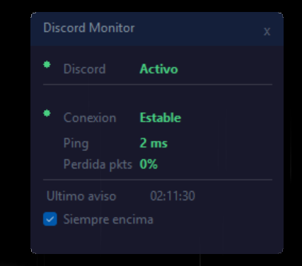

# Discord Connection Monitor

**Lightweight Windows overlay that monitors your internet connection during Discord calls and alerts you when the connection drops.**


---

## ✨ Features

- **Auto-detection**: Automatically detects when Discord is running
- **Real-time monitoring**: Checks internet connection every 2 seconds via ping to Google DNS (8.8.8.8) and Cloudflare (1.1.1.1)
- **Triple alert system**:
  - 🔊 **Voice alert** (Text-to-Speech in Spanish)
  - 🔔 **System sound** notification
  - 💬 **Windows tray** balloon notification
- **Always-on-top overlay**: Small, draggable window that stays visible
- **Secondary monitor support**: Automatically positions itself on your second screen
- **Auto-start**: Option to launch with Windows
- **Low resource usage**: ~15-25 MB RAM, <0.5% CPU

---

## 📥 Download & Installation

### Option 1: MSI Installer (Recommended)

1. Download the latest `DiscordMonitor_Setup.msi` from [Releases](../../releases)
2. Run the installer
3. The app will launch automatically after installation
4. Find the tray icon 🎙️ in your system tray (bottom-right corner)

### Option 2: Portable EXE

1. Download `DiscordMonitor.zip` from [Releases](../../releases)
2. Extract to any folder
3. Run `DiscordMonitor.exe`
4. Right-click tray icon → **"Iniciar con Windows"** to enable auto-start

---

## 🎮 Usage

### First Launch

The overlay window will appear in the **top-right corner of your secondary monitor** (or primary if you only have one).

### Interface



- **Discord status**: Shows if Discord is running
- **Connection status**: Green = stable, Red = no connection
- **Ping**: Current latency in milliseconds
- **Packet loss**: Percentage of lost packets
- **Last alert**: Timestamp of the most recent connection drop alert

### Moving the Window

Click anywhere on the window and drag to reposition it.

### Settings

**Right-click the tray icon** to access:
- **Mostrar**: Show the overlay window
- **Iniciar con Windows**: Toggle auto-start on Windows boot
- **Salir**: Exit the application

### When Connection Drops

If Discord is running and your internet drops, you'll get:
1. Two urgent beep sounds
2. Voice announcement: *"Atención. Se cayó la conexión. Estás en llamada de Discord."*
3. Windows notification bubble

**Cooldown**: Alerts won't repeat more than once every 8 seconds to avoid spam.

---

## 🛠️ Build from Source

### Requirements

- [.NET 10 SDK](https://dotnet.microsoft.com/download/dotnet/10.0)
- [WiX Toolset v3.14](https://github.com/wixtoolset/wix3/releases) (only for MSI creation)

### Steps

1. **Clone the repository**
   ```bash
   git clone https://github.com/yourusername/discord-connection-monitor.git
   cd discord-connection-monitor
   ```

2. **Build the application**
   ```bash
   build.bat
   ```
   This generates `publish\DiscordMonitor.exe` and all dependencies.

3. **Create the MSI installer** (optional)
   
   After installing WiX Toolset:
   ```bash
   cd Installer
   candle.exe Product.wxs -o Product.wixobj
   light.exe Product.wixobj -ext WixUIExtension -ext WixUtilExtension -o ..\publish\DiscordMonitor_Setup.msi -sice:ICE91
   ```

---

## 📂 Project Structure

```
discord-connection-monitor/
├── DiscordMonitor/
│   ├── Program.cs              # Application entry point
│   ├── MainForm.cs             # Main UI and monitoring logic
│   └── DiscordMonitor.csproj   # Project configuration
├── Installer/
│   ├── Product.wxs             # WiX installer definition
│   └── License.rtf             # License text shown in installer
├── build.bat                   # Build script
└── README.md
```

---

## 🔧 Technical Details

| Component | Details |
|-----------|---------|
| **Language** | C# (.NET 10) |
| **UI Framework** | Windows Forms |
| **TTS Engine** | System.Speech (Windows native) |
| **Network Check** | ICMP ping via `System.Net.NetworkInformation` |
| **Process Detection** | `System.Diagnostics.Process` |
| **Installation** | WiX Toolset v3 (MSI) |
| **Install Location** | `%LocalAppData%\DiscordMonitor` |
| **Auto-start Registry** | `HKCU\Software\Microsoft\Windows\CurrentVersion\Run` |

---

## ❓ FAQ

**Q: Does this require administrator privileges?**  
A: No. It installs in your user AppData folder and uses user-level registry keys.

**Q: Will this work with other voice apps like TeamSpeak or Zoom?**  
A: Currently it only detects Discord. Support for other apps may be added in future versions.

**Q: Can I change the alert language to English?**  
A: Yes, edit `MainForm.cs` line ~290 and change the TTS message, then rebuild.

**Q: Why does it monitor connection even when Discord isn't running?**  
A: The app always monitors connection status but only triggers alerts when Discord is detected.

**Q: How do I uninstall?**  
A: Use Windows Settings → Apps → Discord Monitor → Uninstall, or run the MSI again and choose Remove.

---

## 🐛 Troubleshooting

**The window doesn't appear**
- Check the system tray (bottom-right) for the app icon
- Right-click the icon → "Mostrar"

**No alerts when connection drops**
- Make sure Discord is running (the app only alerts during active Discord sessions)
- Check that your volume isn't muted

**App doesn't start after installation**
- Make sure you have [.NET 10 Desktop Runtime](https://dotnet.microsoft.com/download/dotnet/10.0) installed

---

## 📝 License

MIT License - feel free to modify and distribute.

---

## 🤝 Contributing

Pull requests are welcome! For major changes, please open an issue first to discuss what you'd like to change.

---

## 💡 Roadmap

- [ ] English language support
- [ ] Customizable alert sounds
- [ ] Support for other voice apps (TeamSpeak, Zoom, Skype)
- [ ] Connection quality graph
- [ ] Custom ping targets
- [ ] Dark/light theme toggle

---

## 📧 Support

If you encounter any issues, please [open an issue](../../issues) on GitHub.

---

**Made with ❤️ for Discord users who need reliable connection monitoring**
